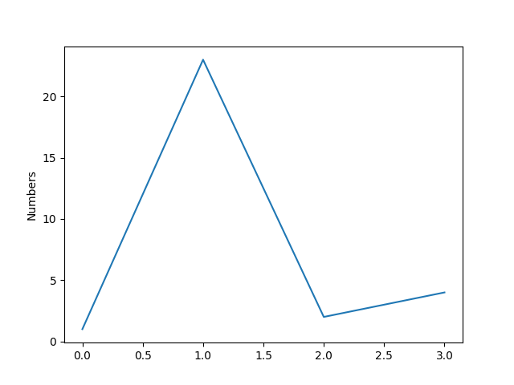

```python3
__title__ = "Captain McNugget's Treasure Chest"
__author__ = "Dr. DOSB"

import re, string
import matplotlib.pyplot as plt
from datetime import datetime
from random import random


```


# Lorem

Lorem ipsum dolor sit amet, consectetur adipiscing elit. Integer posuere, risus ut scelerisque maximus, augue enim varius nisl, eu euismod justo metus varius turpis. Pellentesque quis sapien quis erat vulputate sodales vitae eget eros. Etiam nec arcu faucibus, volutpat augue vitae, rutrum justo. Nullam vel orci quis nunc finibus gravida sed a felis. Vivamus vel justo fringilla, hendrerit erat vitae, fermentum orci. Ut nec dapibus velit. Cras hendrerit suscipit laoreet.

## Ipsum

Duis sed interdum dui, vel porta urna. Praesent iaculis sem ac turpis pulvinar, vel blandit ipsum maximus. Nullam commodo, felis ac porttitor varius, ipsum elit finibus est, quis porttitor lacus quam sit amet diam. Sed tellus augue, lacinia ut sodales at, iaculis sit amet sapien. Proin rhoncus mauris neque, ac vehicula urna auctor at. Nam bibendum efficitur lacus, venenatis cursus elit mattis eu. Maecenas auctor, orci ut finibus efficitur, felis arcu luctus dui, at aliquet lectus mauris sed felis. Cras at nisl venenatis, sollicitudin enim a, vulputate odio. Nulla non fringilla felis. Quisque vitae lectus porttitor, rhoncus enim eu, ultrices nunc. Donec eu volutpat urna. Nulla id nisi metus. Duis auctor semper nulla, vitae mattis nisl vestibulum lacinia. 


```python3

class Py2md:

    def __init__(self, path, output):
        """Class constructor. Parses, converts, and saves the input file"""

        self.source = self.read_file(path)

        self.parser = Parser(self.source)
        self.parsed_text = self.parser.parsed_text
        self.meta = self.parser.meta
        self.converter = Convert(self.source, self.parsed_text, self.meta)
        self.newfile = self.converter.new_file

        self.newfile = ''.join(self.newfile)
        # In case I went too far with including "\n"s
        # self.newfile = re.sub('\n\n', '\n', self.newfile)
        self.save_file(self.newfile, output)

    def read_file(self, path):
        """Read file and load into memory"""
        with open(path, 'r') as f:
            return f.readlines()

    def save_file(self, source, output):
        """Save the file"""
        with open(output, 'w') as f:
            f.write(source)


```


Donec a mi ultricies, egestas lorem a, accumsan nisi. Sed a augue bibendum purus malesuada cursus nec at eros. Aenean auctor sit amet neque lobortis mollis. Donec vestibulum auctor libero, at accumsan nunc mollis eget.


```python3

plt.plot([1,23,2,4])
plt.ylabel('Numbers')

plt.savefig('plot.png')

"""

"""

```


